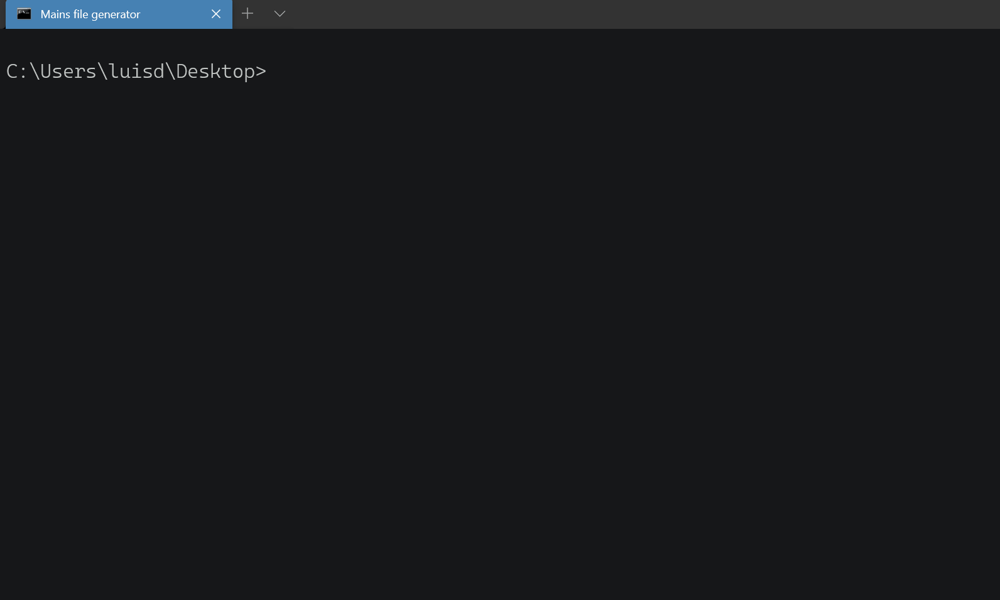

##  

The program allows to generate the main file with a hello world  
of languages such as c++, c#, java, python and ruby.

## Installation
Only need to download genmain.exe file 
Or download Main.cpp, Generator.cpp and and compile them 
~~~cmd
g++ Main.cpp -o genmain
~~~

## Configuration
**Optional**
Add the location of genmain in the path system variable to be able to generate main from the console in any location

## Usage  
Open shell and execute 
~~~cmd
genmain name_language file_name
~~~

    

For get help
~~~cmd
genmain help
~~~

## Author

 * [David Villalobos](https://github.com/DavidVillalobos)

## Contributing

Pull requests are welcome. For major changes, please open an issue first to discuss what you would like to change.

## License

